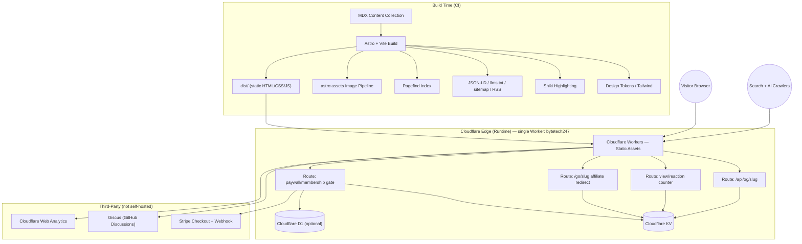

# ByteTech247 — Build Spec

**Version:** 3.2 · **Status:** Audited and hardened, ready for build · **Stack:** Astro + MDX + Tailwind + Pagefind, hosted on Cloudflare Workers (Static Assets) with Worker routes / KV
**Live URL (locked):** `https://bytetech247.workers.dev` — deployed as a single native Cloudflare Worker named `bytetech247`, not a Cloudflare Pages project (Pages projects cannot use a `*.workers.dev` domain — only standalone Workers get one). See §11 for the full brand/SEO identity lock, and Phase 11 for the deploy mechanics this implies.

**Definition of Done (applies to every phase below):** a phase is complete only when `npm run build` succeeds, Lighthouse CI passes with no regression, the phase's own **Verify** step passes, and every listed item is actually implemented — not scaffolded and left half-done. Work one phase at a time in this order; do not skip ahead.

---

## Table of Contents

**Part 0 — Roadmap & Milestones**

**Part I — Architecture & Direction**
1. System Architecture (Frontend / Backend / CI-CD)
2. Architecture Diagram
3. Rendering Strategy
4. Design → Score Mapping
5. Environment Variables & Secrets Inventory
6. Tooling & Version Pins
7. Testing Strategy
8. Assumptions & Risks
9. Content Taxonomy & URL Structure
10. Header, Footer & Navigation Structure
11. Site Identity & Web Search Presence (Locked)

**Part II — Build Phases**
- Phase 0 – Project Scaffold (incl. category routing, About/Contact/Privacy/404 static pages)
- Phase 1 – Design Token System
- Phase 2 – Layout Primitives & Component System (incl. author bio component)
- Phase 3 – Content Engineering (MDX) (incl. category taxonomy)
- Phase 4 – Code Block Engineering
- Phase 5 – Interaction Layer
- Phase 6 – Accessibility Architecture
- Phase 7 – Progressive Enhancement Baseline
- Phase 8 – Search
- Phase 9 – SEO / AEO / GEO Structure (incl. markdown export, per-category RSS, author page, Organization/publisher schema, NewsArticle/TechArticle typing)
- Phase 10 – Performance Gates
- Phase 11 – Cloudflare Infrastructure
- Phase 12 – Documentation
- Phase 13 – Advanced Add-Ons (post-launch, incl. Trending)
- Phase 14 – Monetization Infrastructure (optional)

**Part III — Operating Notes**

**Part IV — Glossary**

**Part V — Scale Playbook**

---

# Part 0 — Roadmap & Milestones

Effort estimates assume one developer working with Claude Code, part-time pace. They're planning estimates, not commitments — actual pace depends on how much custom design/content work happens alongside each phase.

## Milestone map

| Milestone | Phases | Est. effort | Ships | Depends on |
|---|---|---|---|---|
| **M1 — Foundation** | 0, 1, 2 | ~1–1.5 weeks | Working Astro project, locked design tokens, reusable component library, category taxonomy locked and `/category/slug` routing in place | Nothing — starting point |
| **M2 — Content & Code Engine** | 3, 4 | ~1 week | Real posts render correctly — categorized and tagged — with full MDX components and engineered code blocks | M1 (needs tokens + components + category routing) |
| **M3 — Interaction & Accessibility** | 5, 6, 7 | ~1 week | Site feels premium (command palette, transitions) and passes accessibility audit at zero-JS baseline | M2 (needs content to navigate between) |
| **M4 — Search & Discovery** | 8, 9 | ~1 week | Site is fully searchable and structured for SEO/AEO/GEO — crawlable, citable, indexable, with category-aware breadcrumbs and sitemap | M3 (needs finished pages to index) |
| **M5 — Performance & Launch Infra** | 10, 11, 12 | ~1 week | Lighthouse-gated, deployed on Cloudflare Workers (`bytetech247.workers.dev`), documented for future contributors | M4 |
| **🚀 MVP LAUNCH** | — | — | **Site is live, indexed, and fully operational** | M1–M5 complete |
| **M6 — Post-Launch Hardening** | 13 | ongoing, ~1–2 weeks initial | Semantic related-posts, freshness signals, security headers, CI content checks | Live traffic/content to work with |
| **M7 — Monetization** (optional) | 14 | ~1 week per revenue stream added | Ads, affiliate links, membership, newsletter — added only when traffic justifies it | M6, deliberate business decision |

## Sequencing rules
- Do not start a milestone before its dependency milestone's phases are all individually Verified (see each phase's **Verify** line in Part II).
- **Lock the category taxonomy (Part I §9) before Phase 3 content authoring begins.** Categories are part of the URL (`/category/slug`) — retrofitting or renaming a category after posts are published means new URLs, redirects, and updated internal links/sitemap/JSON-LD, not just a content edit.
- M6 and M7 are **not required for launch** — MVP is fully defined by M1–M5.
- Within M7, add revenue streams one at a time (Phase 14 sub-items), re-running Lighthouse CI and the CSP check after each one, per the sequencing note in Phase 13/14.

## Visual timeline

```mermaid
gantt
    title Tech Blog Build Roadmap
    dateFormat  X
    axisFormat %s

    section M1 Foundation
    Phase 0 Scaffold + Categories :m1a, 0, 2d
    Phase 1 Design Tokens      :m1b, after m1a, 2d
    Phase 2 Components         :m1c, after m1b, 2d

    section M2 Content Engine
    Phase 3 MDX + Taxonomy     :m2a, after m1c, 3d
    Phase 4 Code Blocks        :m2b, after m2a, 2d

    section M3 Interaction and A11y
    Phase 5 Interaction Layer  :m3a, after m2b, 3d
    Phase 6 Accessibility      :m3b, after m3a, 2d
    Phase 7 Progressive Enh.   :m3c, after m3b, 1d

    section M4 Search and SEO
    Phase 8 Search             :m4a, after m3c, 1d
    Phase 9 SEO AEO GEO        :m4b, after m4a, 3d

    section M5 Perf and Launch
    Phase 10 Performance Gates :m5a, after m4b, 2d
    Phase 11 Cloudflare Infra  :m5b, after m5a, 3d
    Phase 12 Documentation     :m5c, after m5b, 2d

    section Launch
    MVP Launch                 :milestone, after m5c, 0d

    section M6 Post-Launch
    Phase 13 Advanced Add-Ons  :m6a, after m5c, 10d

    section M7 Monetization
    Phase 14 Monetization      :m7a, after m6a, 7d
```

---

# Part I — Architecture & Direction

## 1. System Architecture — Frontend & Backend

This is not a traditional client/server app — it's a **static-first site with a thin edge backend**.

### Frontend (build-time + client-side)

| Layer | Contains |
|---|---|
| Framework core | Astro pages/layouts (`.astro`), MDX content collection, Vite build pipeline |
| Design system | Design tokens (OKLCH colors, type scale, spacing, motion), Cascade Layers, Tailwind config reading from tokens |
| Component library | Layout primitives (`Stack`, `Cluster`, `Grid`, `Center`); CVA-based components (Button, Card, Badge, Tag pill); MDX components (`Callout`, `CodeTabs`, `Figure`, `Benchmark`, `TableOfContents`) |
| Client-side islands (minimal hydrated JS) | Search bar + command palette (⌘K), dark-mode toggle, View Transitions handler, reading-progress bar |
| Build-time generators | Shiki syntax highlighting, Pagefind search index, reading-time calculator, related-posts (tag or embedding based), `llms.txt` generator, `sitemap.xml` generator, RSS/Atom feed generator (sitewide + per-category), per-post Markdown export generator, JSON-LD emitter, static OG-image fallback (if per-request generation isn't used). Trending-posts calculator (from batched KV view counts, scheduled rebuild) is post-launch — Phase 13, not MVP |
| Static assets | Self-hosted subsetted fonts, icons, `astro:assets`-optimized images (AVIF/WebP), `robots.txt`, `_headers` (CSP/HSTS) |
| Output | Fully static `dist/` folder — plain HTML/CSS/JS, no server required to serve it |

### Backend (runtime, edge-executed — a single native Cloudflare Worker)

Intentionally thin. Nothing here renders page content — it only handles what must happen per-request. All of it lives inside **one** deployed Worker (`bytetech247`) as route branches in its `fetch()` handler, falling through to static-asset serving for every route not explicitly listed below — this is not a fleet of separate Workers, and it is not Cloudflare Pages Functions (Pages is not used at all — see §11 and Phase 11).

**Edge routes (same Worker, not separate Workers):**
- `/api/og/[slug]` — dynamic OG image generation (Satori); generated once per post, cached indefinitely at the edge (Cache API), purged only when that post's content changes — never regenerated per request
- View counter / reaction counter endpoint — batches/debounces client-side, flushes to KV on an interval rather than writing on every single pageview
- IndexNow ping handler — triggered on deploy webhook
- Affiliate redirect handler — `/go/[slug]` → 302, click logged to KV (Phase 14)
- Paywall/membership gate check — validates signed cookie/JWT before serving gated MDX body (Phase 14)
- (Optional) rate-limiting middleware for any public write endpoint

**Data stores:**
- Cloudflare KV — view counts, reaction counts, affiliate click counts, lightweight session/member state
- Cloudflare D1 (SQLite, optional) — only if native threaded comments replace Giscus, or membership state outgrows KV

**Third-party backend (not self-hosted):**
- Giscus — comments, backed by GitHub Discussions API
- Cloudflare Web Analytics — passive collection, no custom backend code
- Stripe (if Phase 14 membership is built) — checkout + webhook, no payment logic self-hosted

**Config/bindings:**
- `wrangler.toml`/`wrangler.jsonc` — static assets binding (`[assets] directory = "./dist"`, so the same Worker serves the built Astro site), KV namespace bindings, D1 bindings (if used), environment bindings

### Deployment, CI/CD & Rollback

| Layer | Contains |
|---|---|
| CI | GitHub Actions: `astro check`, ESLint/Prettier, Lighthouse CI gate, broken-link + stale-code-snippet checker |
| CD | Native Cloudflare Workers — CI builds (`astro build && pagefind --site dist`) then deploys via `wrangler deploy` (a CI step, not an automatic Git-push integration the way Pages worked). Single Worker, live at `bytetech247.workers.dev` |
| Preview deployments | `wrangler versions upload` per PR/branch — produces a unique preview version URL (Workers' equivalent of a Pages preview deployment) — review before promoting a version to 100% traffic |
| Rollback | `wrangler rollback`, or promote a prior version via the Cloudflare dashboard — instant rollback to any previous deployed version; tag stable releases in Git (`v1.0.0`, etc.) for traceability |
| Post-deploy hooks | Search Console sitemap submission (API), IndexNow ping |
| Domain/DNS | Cloudflare DNS (if domain is also on Cloudflare) |

### Precise summary
- **Frontend = ~95% of the codebase.** Nearly everything a visitor reads is pre-built static HTML.
- **Backend = a handful of small, single-purpose edge functions.** No monolithic server, no content database (content lives in Git as MDX), no ORM, no custom auth system.
- If comments stay on Giscus and reactions/view-counts/monetization gating are skipped, **the backend can be reduced to zero custom code** — decide this explicitly before Phase 11, not by default.

---

## 2. Architecture Diagram

This diagram is the single reference for "what talks to what" — update it if a phase changes the data flow.

---

## 3. Rendering Strategy

- **Model: full Static Site Generation (SSG) + Islands Architecture.** Every page is rendered to plain HTML at build time — no per-request server rendering for content.
- **Islands = the exceptions.** Only interactive pieces (search, command palette, dark-mode toggle, view transitions) hydrate individually with a small JS bundle each. Article text, images, and code blocks ship as zero-JS static HTML — unlike a typical React/Next.js SPA where one large bundle hydrates the whole page.
- **Workers/SSR are the exception, not the rule.** Only OG-image generation, counters, affiliate redirects, and the paywall gate run per-request at the edge. Article content itself is never dynamically rendered — a Worker or KV hiccup only affects a counter or gate check, never the article.
- **Why it matters:**
  - Crawlability — search and AI bots receive complete final HTML immediately, no JS execution required.
  - Core Web Vitals — no client-side render step, so LCP/INP are strong by default.
  - Resilience — content stays readable even if an auxiliary edge function fails.

---

## 4. Design → Score Mapping

Design choices (bento grid homepage, OKLCH neutral base + single accent color) are compatible with all target scores but do not earn them alone — each needs a paired implementation requirement.

| Design decision | Score it touches | What actually earns the score |
|---|---|---|
| Bento grid homepage (CSS Grid) | Performance, Core Web Vitals | Pure `grid-template-areas` computed at build time — no JS masonry library, no runtime reflow |
| Hero tile gradient-mesh background | Performance | Rendered as CSS, not an image file — zero bytes, zero decode time |
| Grid tile images (post covers, required — canonical 16:9 source) | Performance (CLS/LCP) | `astro:assets` AVIF/WebP with explicit width/height; LCP element gets `<link rel="preload">`. Every post ships one 16:9 source image; MVP placements (hero tile, grid card, article hero) crop from it via `object-fit: cover` — no per-placement re-uploads. Trending thumbnail crop is Phase 13, post-launch, not part of this list yet |
| OKLCH neutral base + single accent | Accessibility | Every text/background and accent/background pairing tested against WCAG AA (4.5:1 body, 3:1 large text) before tokens are locked |
| Grid tiles as semantic HTML | Accessibility, SEO, AI/GEO | Real `<article>` elements with proper heading hierarchy and real `<a href>` links — not `
` soup or JS-only onClick nav |
| Tag pills / reading time / date shown in grid | SEO, AEO/GEO | Same metadata must also exist in JSON-LD (Phase 9) — visual and structured data stay consistent |
| Self-hosted, subsetted fonts | Performance | `font-display: optional`, subset to used glyphs only |
| Focus states on interactive tiles | Accessibility | Visible keyboard focus ring on every grid tile, command palette, nav item |
| Full SSG output (no client-rendered grid) | Performance, SEO, AI/GEO | Confirms crawlers/AI bots see complete HTML with no JS execution required |

**Action item once tokens are finalized:** run a contrast-ratio pass on the locked OKLCH values before writing them into Phase 1.

---

## 5. Environment Variables & Secrets Inventory

| Variable | Introduced in | Purpose | Stored in |
|---|---|---|---|
| `INDEXNOW_KEY` | Phase 11 | Authenticates IndexNow ping requests | Cloudflare Worker env var (`wrangler secret put`) |
| `CF_KV_NAMESPACE_ID` | Phase 11 | Binds counters/click-tracking KV | `wrangler.toml` |
| `CF_PAGES_DEPLOY_HOOK_URL` | Phase 13 | Triggers the scheduled rebuild that recomputes the trending-posts list from batched KV view counts (post-launch feature) | GitHub Actions secret |
| `GISCUS_REPO` / `GISCUS_CATEGORY` | Phase 11 | Comments config | Public (client-side, non-secret) |
| `GSC_SERVICE_ACCOUNT_JSON` | Phase 11 (optional) | Authenticates the optional Search Console sitemap-submission Action | GitHub Actions secret |
| `EMBEDDING_API_KEY` | Phase 13 | Generates semantic related-posts embeddings at build time | CI secret (GitHub Actions), not shipped to client |
| `STRIPE_SECRET_KEY` / `STRIPE_WEBHOOK_SECRET` | Phase 14 | Checkout + membership webhook verification | Cloudflare Worker env var (`wrangler secret put`, server-side only) |
| `JWT_SIGNING_SECRET` | Phase 14 | Signs membership session cookie | Cloudflare Worker env var (`wrangler secret put`) |
| `AD_NETWORK_CLIENT_ID` | Phase 14 | Ad script identification | Public (client-side, non-secret) |
| `GA4_MEASUREMENT_ID` | Phase 14 | Google Analytics 4, added alongside Cloudflare Web Analytics once conversion/funnel tracking is needed | Public (client-side, non-secret) |

---

## 6. Tooling & Version Pins

Pin these explicitly in the repo (`.nvmrc`, `package.json` engines field) so builds are reproducible across machines and CI:

| Tool | Pinned version approach | Why |
|---|---|---|
| Node.js | LTS at project start, pinned via `.nvmrc` | Astro/Vite behavior can shift across major Node versions |
| Package manager | Lockfile committed (`package-lock.json` or `pnpm-lock.yaml`) | Prevents dependency drift between local/CI/Cloudflare build |
| Astro | Pinned exact version in `package.json`, bumped deliberately | Avoids silent breaking changes from auto-upgrades |
| Wrangler (Cloudflare CLI) | Pinned as devDependency, not global install | Keeps Worker deploy behavior consistent across contributors |

---

## 7. Testing Strategy

| Layer | Tooling | What it catches |
|---|---|---|
| Type safety | `astro check`, TypeScript strict mode | Broken props, invalid frontmatter shape |
| Unit tests | Vitest for utility functions (reading-time calculator, related-posts scoring, frontmatter validation) | Logic errors in build-time generators |
| Edge function tests | Local Worker testing via `wrangler dev` / Miniflare (or `@cloudflare/vitest-pool-workers`) | Bugs in OG-cache logic, counter batching, and paywall JWT verification — caught before they reach production |
| Accessibility | `axe-core` run in CI against built pages | Contrast, landmark, ARIA regressions before they ship |
| Visual/E2E | Playwright — smoke test homepage, a post page, search, command palette, dark-mode toggle; run at both mobile and desktop viewports (mobile is the Lighthouse gate per Phase 10, so E2E coverage should match) | Catches rendering/interaction regressions across phases |
| Performance | Lighthouse CI (already in Phase 10) | Core Web Vitals regressions |
| Link/content integrity | Broken-link + stale-code checker (Phase 13) | Credibility rot over time |

Run unit + edge-function + accessibility + type checks on every PR; run Playwright + Lighthouse CI on every PR targeting the production branch.

---

## 8. Assumptions & Risks

- **Single author / small team** — this spec assumes direct Git commits for content, not a multi-author CMS workflow. Re-architect Phase 3 if that changes.
- **KV is eventually consistent, and the free plan resets at only 1,000 writes/day** — batched/debounced counter writes (Phase 11) are the default for this reason, not an extreme-scale-only optimization. KV remains unsuitable for anything requiring strong consistency (e.g. inventory, financial balances) regardless of batching.
- **Embedding API costs money at scale** (Phase 13) — fine for a personal blog's post volume; re-evaluate cost if content volume grows into the thousands.
- **Ad network / Stripe / payment terms are business decisions, not architecture** — verify current ToS, payout terms, and tax handling directly with each provider before committing revenue-critical phases.
- **IndexNow only reaches Bing/Yandex** — Google requires separate sitemap-based discovery; do not assume IndexNow alone accelerates Google indexing.

---

## 9. Content Taxonomy & URL Structure

*Added in v1.6, category list locked in v2.3.*

- **Locked category list (final, do not add/rename without re-reading the sequencing rule below):** `Dev Tools`, `Data & Automation`, `AI Productivity`, `Guides & Fixes`.
- **Two separate axes, not one:** `category` (single, required, topic-based, the four above) drives navigation, the URL, and homepage sectioning. `tags` (existing, multiple, free-form — e.g. `Docker`, `Git`, `Cloud Hosting`, `Python`, `SQL`, `Excel`, `Linux`, `AWS`) stay for cross-cutting labels. These read like subcategories but are deliberately implemented as tags, not nested categories — §9 is single-level by design, so `/category/subcategory/slug` routing is out of scope; a tag page (`/tag/docker`) gives the same discoverability without the added routing complexity. Content-type distinctions (tutorial vs. news vs. deep-dive) should not be forced into `category` alongside topic — resolve as a separate `format` field if needed.
- **None of the four locked categories are inherently time-sensitive** — expect every post to emit `BlogPosting`/`TechArticle` (§9 schema-type rule, Phase 9), not `NewsArticle`, unless a genuinely news-type category is added later.
- **URL pattern:** `bytetech247.workers.dev/category/slug` — requires a dynamic `[category]/[slug].astro` route (Phase 0) in place of a flat `/blog/[slug]`.
- **Schema enforcement:** `category` becomes a required field in the Content Collections Zod schema (Phase 3), validated against a fixed enum — an invalid or unlisted category fails the build rather than creating an orphan page.
- **Downstream effects to account for:** JSON-LD `BreadcrumbList` (Phase 9) becomes Home → Category → Post; sitemap and nav (Phase 2 header) must enumerate categories; homepage gets per-category grid sections beneath the bento hero, using existing layout primitives — no new tooling required.
- **Sequencing constraint:** the category list must be locked before Phase 3 content authoring begins (see Part 0 sequencing rules) — renaming a category after posts ship means new URLs and redirects, not just a content edit.
- **Schema type follows category:** posts in a genuinely time-sensitive category (e.g. an "AI News"/"Tech News" category, if added to the locked list) get `NewsArticle` JSON-LD (Phase 9); tutorial, benchmark, and deep-dive posts keep `BlogPosting` or `TechArticle`. The schema type is derived from `category` per post, not applied site-wide — misrepresenting evergreen content as `NewsArticle` risks Google discounting the markup rather than helping it.

---

## 10. Header, Footer & Navigation Structure

*Added in v1.7. This is a shared-component spec, not a per-page one — the header and footer are the same component instances on every route (Phase 2), with a small set of page-type-specific additions layered on top. Written explicitly so the build doesn't improvise nav/footer content per template.*

### Global header/nav — identical on homepage, article pages, category archives, everywhere
- **Left:** site logo/name, links to `/`. Reads from `src/config.ts` (Phase 0 single source of truth) — never hardcoded per template.
- **Primary nav:** one real `<a href>` per locked category from §9 (`Dev Tools`, `Data & Automation`, `AI Productivity`, `Guides & Fixes`). Each category is paired with a `
/
` disclosure revealing its most-used tags (computed at build time from that category's posts, e.g. Dev Tools surfaces Docker, Git, Cloud Hosting, AWS — see Phase 2) plus a "View all in [Category]" link to the archive. Native HTML disclosure, not a JS dropdown — every link is a real `<a href>` in the DOM regardless of open/closed state, so it's keyboard-operable and fully crawlable with zero JS (Phase 7 baseline).
- **Right:** search trigger (opens the ⌘K command palette, Phase 5/8), dark-mode toggle (Phase 5).
- **Mobile:** menu icon positioned left, before the logo (editorial convention). Tapping it opens the collapsed category nav — same tag disclosures as desktop — as an overlay/slide-in panel. Search and dark-mode toggle stay visible on the right, outside the collapse.
- **Sticky vs. static:** default to **static** (simplest, zero extra JS/CLS budget). Sticky-on-scroll is a legitimate upgrade but treat it as a Phase 13 add-on, not baseline — decide explicitly rather than defaulting into it.

### Article-page-only header additions (layered on the shared header, not replacing it)
- Reading progress bar (Phase 5) — thin bar beneath the header, fills on scroll.
- Compact "← [Category name]" back link, top-left of the article body — reuses the same href as the breadcrumb's category segment below, not a JS `history.back()` (which breaks with JS disabled and can land somewhere unexpected depending on how the reader arrived).
- Visual breadcrumb, Home → Category → Post title — same hierarchy as the JSON-LD `BreadcrumbList` (Phase 9), so visible and structured data agree.
- Table of contents sidebar (Phase 2/3) — sits alongside the article body, not inside the header itself.

### Global footer — identical on every page
- **Site column:** site name + one-line description (from `src/config.ts`), social links.
- **Categories column:** same list as header nav — redundant internal linking is deliberate, it reinforces topical clustering for SEO/AEO.
- **Company column:** About, Contact.
- **Legal column:** Privacy, Terms & Conditions, Affiliate/Advertising Disclosure, Editorial Policy — grouped separately from Company so trust/compliance pages read as their own scannable cluster, not buried in a generic list.
- **Resources column:** RSS feed link, sitemap link, full archive/all-posts link.
- **Bottom bar:** copyright line.
- Five columns total on desktop; collapses to a stacked/accordion list on mobile, same responsive pattern as the rest of the layout.

### Article-page-only footer-region additions (between article body and the global footer)
- Tag pills for that post (existing Phase 3 `tags` — a separate row from the single `category`).
- Related-posts strip (tag-based in Phase 3, upgraded to semantic similarity in Phase 13).
- Giscus comments (Phase 11).
- Series prev/next navigation, if the post belongs to a series (Phase 3).

---

## 11. Site Identity & Web Search Presence (Locked)

*Added in v3.1, following the rebrand from "Advanced Tech Blog" to ByteTech247 and the lock of the live URL. Everything in this section reads from `src/config.ts` (Phase 0) as the single source — no template re-declares any of it.*

### Locked brand facts
- **Site/brand name:** ByteTech247
- **Canonical live URL:** `https://bytetech247.workers.dev` (native Cloudflare Worker, not Pages — see Phase 11)
- **SEO meta title** (54 characters, user-supplied and locked as-is): `ByteTech247 | Dev Tools, Automation & AI Productivity`
- **SEO meta description** (147 characters, user-supplied and locked as-is): `ByteTech247 delivers expert Dev Tools, Data & Automation, and AI Productivity insights. Get production-ready Guides & Fixes to optimize your technical workflows.`

### Assessment of the locked title/description
Both are solid as given, no wording changes recommended:
- Title is 54/~60 characters — safely inside Google's SERP truncation limit, with the brand name first (best practice for brand recall) followed by a keyword-bearing descriptor.
- Description is 147/~155–160 characters — safely inside the typical snippet limit, and reads as a real sentence rather than a keyword-stuffed fragment, which is what both Google's ranking systems and AI answer engines (AEO/GEO, Phase 9) favor.
- Notably, between the title and description, **all four locked categories from §9** (Dev Tools, Data & Automation, AI Productivity, Guides & Fixes) are represented. That's not a coincidence worth losing — it means the meta tags and the site's actual information architecture already agree with each other, which is exactly the kind of consistency Phase 9's JSON-LD/meta alignment rule asks for elsewhere. Don't let a future edit to either drift out of sync with the other.

### Fields drafted to round out the presence (professional recommendation, not user-supplied — flagged as such)
These extend the locked title/description into every surface Phase 9 already specifies, so the identity is consistent everywhere rather than a lone `<title>` tag:
- **OG title / OG description:** mirror the locked meta title/description exactly. No platform-specific variant — one source, per Phase 0's config.ts rule.
- **Twitter Card:** `summary_large_image`, same title/description, `og:image` per-post (Phase 9/10 OG pipeline).
- **JSON-LD `Organization`/publisher** (Phase 9): `name: "ByteTech247"`, `url: "https://bytetech247.workers.dev"`. `logo` and `sameAs` (real social/GitHub links) are **open items** — do not fabricate placeholder values for these; leave them out of the emitted JSON-LD until real assets/accounts exist, rather than shipping a broken or fake logo URL/social link.
- **`llms.txt` header:** H1 `# ByteTech247`, blockquote summary reusing the locked meta description verbatim (Phase 9 already requires description alignment across surfaces — this satisfies it by construction).
- **RSS feed titles** (Phase 9): sitewide feed titled "ByteTech247"; per-category feeds titled "ByteTech247 — [Category Name]".
- **Footer copyright line** (§10): "© [current year] ByteTech247".

### Resolved (v3.2): logo + social identity
- **Logo/favicon assets** — designed and committed at repo root under `brand-assets/`: `favicon.svg` (32×32, simplified mark, no status dot — kept ultra-legible at 16–32px), `logo-mark.svg` (128×128, full mark with amber status dot, for app icons/social avatars/`Organization.logo`), `logo-full.svg` (horizontal lockup, mark + "ByteTech247" wordmark, for the site header). Brand teal `#0D9488`, accent amber `#F59E0B`. Google accepts SVG directly for `Organization.logo` (min. 112×112 — `logo-mark.svg` at 128×128 clears this), but also export a PNG fallback (e.g. 512×512) during Phase 0/10 asset setup for universal compatibility with tools that don't parse SVG.
- **Social/`sameAs` links** — real accounts, all `@bytetech247`:
  - Facebook: `https://www.facebook.com/bytetech247`
  - X: `https://x.com/bytetech247`
  - Instagram: `https://www.instagram.com/bytetech247`
  - TikTok: `https://www.tiktok.com/@bytetech247` (note: TikTok profile URLs require the `@` inside the path — don't drop it)
  - Applied to `Organization.sameAs` (Phase 9) — correct primary placement, these are the brand's official accounts. Also applied to `Person.sameAs` (the author) since this is a solo blog where the author and the brand are effectively the same public identity — reconsider only if a second author is ever added.
- **Author identity** — real name confirmed: `Aboagye Annor`. `siteConfig.author.name` in Phase 0's config, `Person.name` in Phase 9's JSON-LD, and `AuthorBio` (Phase 2) on `/about` and per-post all use this — no more placeholder. `author.bio` (a short credentials line) is still not supplied; leave it empty/omitted rather than inventing one.
- **Article byline placement (locked UI rule):** on the article page, render `By Aboagye Annor` immediately before the date in the post-meta line — same `<time>`/date formatting already in place (`toLocaleDateString("en-US", { year: "numeric", month: "long", day: "numeric" })`), just with the byline prepended. Applies to the article template only (not the homepage/archive `PostCard`, which stays as-is unless explicitly extended later).

### Still open (not blocking Phase 0–8)
- Whether `bytetech247.workers.dev` is the permanent public URL or an eventual custom domain (e.g. `bytetech247.com`) gets attached later — this is a deliberate business decision, not an architecture default; the spec as written treats the `workers.dev` subdomain as the real, permanent live URL unless told otherwise.

---

# Part II — Build Phases

## Phase 0 — Project Scaffold

- Astro project, TypeScript strict mode
- Tailwind CSS configured to read from a token layer (not hardcoded values)
- Content Collections set up for `src/content/blog/*.mdx`
- Site config single source of truth (e.g. `src/config.ts`): canonical site URL (`https://bytetech247.workers.dev`), site name (`ByteTech247`), the locked meta title/description (§11), author, social links, default OG fallback image — every later SEO/OG/JSON-LD/RSS module (Phases 9, 11) reads from this, never hardcodes its own copy
- ESLint + Prettier + Astro check in CI
- Git repo initialized, connected to GitHub
- Static pages referenced by the footer (§10): About, Contact, Privacy, Terms & Conditions, Affiliate/Advertising Disclosure, Editorial Policy, and an all-posts/archive route — so no footer link 404s once this phase is Verified. About doubles as the author bio page (Phase 9) — single-author blog per §8, so this is one route, not two
- Custom 404 page: on-brand, includes search trigger and category links so a broken URL doesn't dead-end a visitor
- **Verify:** `npm run build` succeeds on a clean clone with only the lockfile installed; every footer/nav link resolves to a real route, not a 404; hitting an unknown route renders the custom 404, not a blank Cloudflare default

## Phase 1 — Design Token System

- CSS custom properties (or Tailwind theme extension) for:
  - Color system in OKLCH, generating light/dark from one source
  - Modular type scale (ratio 1.25 or 1.333)
  - Spacing scale on an 8px grid
  - Motion tokens: `--duration-fast/base/slow`, `--ease-out-expo` etc.
- Cascade Layers structure: `@layer reset, tokens, base, components, utilities, overrides`
- Fluid typography via `clamp()` driven by viewport width
- `text-wrap: balance` on headings, `text-wrap: pretty` on body copy
- **Verify:** contrast-ratio check passes WCAG AA on every token pairing before merging

## Phase 2 — Layout Primitives & Component System

- Composable layout primitives: `<Stack>`, `<Cluster>`, `<Grid>`, `
` (Every Layout pattern)
- `class-variance-authority` (CVA) for component variants (Button, Badge, Card, etc.)
- Base components: header, footer, nav, post card, tag pill, TOC sidebar
- Author bio component (avatar, name, one-line credentials, links) — single component reused at the bottom of every post and on the `/about` page (Phase 9)
- Category nav dropdown data: top tags per category, computed at build time from the Phase 3 content collection (pure aggregation over existing frontmatter — no new infra, no KV, no edge dependency)
- Homepage composition: bento hero, then `Recent` (reverse-chronological), then per-category (§9) sections — assembled from existing `Grid`/`Stack` primitives, no new layout tooling required. A `Trending` section and `TrendingList` component are added post-launch (Phase 13) once there's real traffic to rank by — not part of MVP
- **Verify:** every component renders correctly with zero JS (progressive enhancement check starts here, not just Phase 7)

## Phase 3 — Content Engineering (MDX)

- Custom MDX components: `<Callout>`, `<CodeTabs>`, `<Figure>`, `<Benchmark>`, `<TableOfContents>` (scroll-spy)
- `<Figure>` requires `alt` as a non-optional prop (TS/build error if omitted) and renders a semantic `<figure>`/`<figcaption>` pair — `alt` describes the image content, the caption gives context or attribution; they are not interchangeable. The HTML `title` attribute is deliberately not used — it carries no meaningful SEO weight, unlike `alt`
- Tables: standard GFM markdown tables (no component import needed), styled via scoped CSS in the article content wrapper — horizontal-scroll wrapper on narrow viewports (not full-page scroll), sticky header row, token-driven borders/zebra striping (Phase 1), semantic `<th scope="col">` for accessibility and for AI/GEO parsing of tabular content. Relevant given the content — comparison and benchmark posts are a natural fit for this blog
- Frontmatter schema: title, description, date, tags, category, relatedSlugs, series, seriesOrder, `coverImage` (required, single 16:9 source, min. 1600×900), `coverImageAlt` (required, non-empty — build fails without it, ties into Phase 6 accessibility)
- Series/collection support with persistent progress sidebar
- Related-posts: `relatedSlugs` (frontmatter) is a manual override, shown first and capped at the section's display limit; any remaining slots are filled automatically from tag-overlap scoring. One system with a manual pin and an automatic fallback, not two competing sources
- Reading time estimate: computed at build time from word count + code-block line count (weighted formula — code reads slower than prose, ~200wpm baseline for text). Rendered in post header next to date/author. No runtime cost.
- **Verify:** frontmatter schema validated by a Content Collections Zod schema — invalid frontmatter fails the build, not silently renders wrong

## Phase 4 — Code Block Engineering

- Shiki highlighting baked at build time, rendered in a single fixed dark theme (e.g. GitHub Dark) regardless of site-wide light/dark mode — protects code readability/visual consistency. Deliberate, scoped exception to Phase 1's token-only color rule (see Part III note)
- Line highlighting, diff notation, line numbers, copy-to-clipboard button (top-right of block; label swaps "Copy" → "Copied!" for ~2000ms on click)
- File-name tabs for multi-file snippets
- Optional: Sandpack embed for runnable JS/TS examples
- **Verify:** Lighthouse CI re-run — code blocks are a common source of unexpected JS weight

## Phase 5 — Interaction Layer

- Astro View Transitions for page-to-page nav
- Reading progress bar (`prefers-reduced-motion`-aware)
- Command palette (⌘K) for nav + search
- Dark mode: respects system preference, remembers manual override, no flash-of-wrong-theme
- **Verify:** Playwright smoke test for command palette open/close and dark-mode persistence across reload

## Phase 6 — Accessibility Architecture

- Skip-to-content link, proper landmark regions
- Managed focus on route change (View Transitions can trap focus if unhandled)
- Fully keyboard-operable command palette and nav
- Contrast baked into token layer, verified against WCAG AA minimum
- Minimum touch target size 24×24px (WCAG 2.5.8 AA) on every interactive element — nav links, category disclosure triggers (§10), buttons — with adequate spacing between adjacent targets to prevent mis-taps on mobile
- **Verify:** `axe-core` run against every page template — zero violations before merge

## Phase 7 — Progressive Enhancement Baseline

- Confirm zero-JS baseline: content, nav, code blocks all fully usable with JS disabled
- Search, command palette, view transitions layered on top as enhancements only
- **Verify:** manual pass with JS disabled in browser dev tools — every article fully readable and navigable

## Phase 8 — Search

- Pagefind wired as a postbuild step: `astro build && pagefind --site dist`
- Search UI wired into command palette
- **Verify:** search returns correct results against a test set of known post titles/content

## Phase 9 — SEO / AEO / GEO Structure

- Per-post JSON-LD: `BreadcrumbList`, `Person` (author) — article type itself follows the category-based rule below, never hardcoded to one type
- Site-level JSON-LD: `WebSite` + `SearchAction`
- Site-level `Organization` JSON-LD (name, logo, url) — referenced as `publisher` on every article. Required by Google for full Article/`NewsArticle` rich-result eligibility, not just author markup
- `Person` (author) schema extended with `url` (linking to the author page below) and `sameAs` (real social/GitHub profile links) — completes the authority signal, not just a name string
- Article schema type follows category (§9): `NewsArticle` for time-sensitive categories, `BlogPosting`/`TechArticle` otherwise — decided per post from its `category` field, never applied site-wide
- Article JSON-LD `image` property lists the `coverImage` in multiple aspect-ratio crops (16:9, 4:3, 1:1), per Google's Article rich-result image guidance — reuses the crops Phase 10 already generates for the UI, not new assets
- Author bio renders directly on the site's `/about` page (already scoped in Phase 0 — single-author blog per §8, so "About" and "Author" are the same route, not two), using the Phase 2 bio component, backing the `Person` JSON-LD — visible credentials, not just structured data
- Editorial Policy page (Phase 0), footer-linked and referenced from `/about`: sourcing, fact-checking, and correction practices. A real E-E-A-T signal alongside the author bio, and commonly expected during display-ad network review (Phase 14)
- OG + Twitter meta tags per post
- Direct-answer paragraph convention (40–60 words) near top of each post
- `FAQPage`/`HowTo` JSON-LD where applicable
- `robots.txt` with explicit per-bot rules (GPTBot, ClaudeBot, Google-Extended, PerplexityBot, Googlebot, Bingbot)
- Auto-generated `llms.txt` at build time from content collection:
  - H1 site name → blockquote summary → prioritized link list (20–50 max, most important first)
  - Keep under ~8KB
  - Description text semantically aligned with JSON-LD descriptions
- Per-post Markdown export: `/[category]/[slug].md` (or a "copy as markdown" button on the post page) serving the raw post body as clean text — gives AI agents/tools a direct alternative to parsing rendered HTML, extending the `llms.txt`/`robots.txt` work above
- Dynamic `sitemap.xml` with accurate `lastmod`
- RSS/Atom feed — sitewide, plus one per category (§9 taxonomy)
- Print stylesheet (`@media print`) stripping nav/sidebar/search
- **Verify:** validate JSON-LD with Google's Rich Results Test — including the `Organization`/publisher block, not just the article schema; validate `llms.txt` renders under 8KB and every listed URL resolves 200; confirm the Markdown export route returns valid raw content for a sample post; confirm each category RSS feed only contains posts from that category; confirm a post in a news-type category emits `NewsArticle` and a tutorial post emits `BlogPosting`/`TechArticle`, not the same type for both

## Phase 10 — Performance Gates

- `astro:assets` image pipeline: accepts any common raster source format (PNG, JPG, etc.) — authors never pre-convert or pre-compress. Always outputs a `<picture>` with AVIF-first, WebP fallback, JPEG safety net for legacy browsers, responsive `srcset`, compressed at build time for every placement below. Compression level isn't hand-tuned to a fixed quality number — it's governed by the mobile Lighthouse gate (Phase 10 below): if a build regresses LCP/CLS, that's the signal to tighten it, not a static target picked in advance
- Animated content (demo GIFs, CLI walkthroughs, etc.): convert to a muted, autoplay, looping `<video>` (MP4/WebM), not an animated GIF or animated WebP — typically 5–10x smaller for equivalent visual content. Animated GIF sources don't go through the static image pipeline above; flag this as a manual authoring step (Phase 12 `CONTRIBUTING.md`), since it needs a different tool than `astro:assets`
- Loading strategy: only the LCP hero/cover image loads eager + preloaded (see below); every other image — inline `<Figure>` images, related-post thumbnails — uses `loading="lazy"`
- Image placements, all cropped at build time from the one required 16:9 `coverImage` (Phase 3) via `object-fit: cover` — no per-placement source uploads:
  - Article-page hero: native 16:9, full content-column width
  - Homepage grid card / category archive card: 16:9
  - Bento hero tile: wide crop (e.g. ~21:9) via `object-position: center`
  - Social/OG image (`/api/og/[slug]`, Phase 11): separate 1200×630 Satori-composited asset, not a crop of `coverImage` — different standard (OG/Twitter Card), may use `coverImage` as a background layer only
  - (Post-launch, Phase 13) Sidebar `TrendingList` thumbnail: near-square crop (~1:1), small — title-scannable, not a full card
- Font subsetting, self-hosted via Cloudflare, `font-display: optional`
- Explicit width/height or aspect-ratio boxes on all media (zero CLS)
- Preload LCP image/font
- Lighthouse CI step in GitHub Actions, gated on the **mobile** device preset (Google indexes mobile-first — mobile is the pass/fail gate, not desktop): fail build if LCP/INP/CLS regress past threshold. Desktop preset also runs, for visibility, but doesn't block the build on its own
- **Verify:** Lighthouse CI (mobile preset) passing on homepage, a post page, and the tag/series pages — not just one template; confirm every card/tile/thumbnail placement renders its correct crop ratio with no layout shift

## Phase 11 — Cloudflare Infrastructure

- Deploy as a single native Cloudflare Worker named `bytetech247`, live at `bytetech247.workers.dev` — **not** Cloudflare Pages. This is a deliberate, locked decision (§11): a `*.workers.dev` domain is only issued to a standalone Worker, never to a Pages project, so Pages is off the table for this site regardless of which is otherwise "simpler."
- Build command: `astro build && pagefind --site dist`, output dir `dist`. `wrangler.toml`/`wrangler.jsonc` binds `dist/` as the Worker's static assets directory (`[assets] directory = "./dist"`) — this is what actually serves the site; no separate CDN product involved
- CI deploys with `wrangler deploy` (GitHub Actions step on merge to `master`) — this replaces the "push to Git → Pages auto-builds" model. The build step and the deploy step are both explicit CI steps now, not implicit
- Worker routes (branches inside the one Worker's `fetch()` handler, checked before falling through to static-asset serving — not separate Workers, not Pages Functions): `/api/og/[slug]` — dynamic OG image generation (Satori), cached at the edge after first render per post (Cache API), not regenerated per request; `/go/[slug]` affiliate redirect; view/reaction counter endpoint; paywall/membership gate check
- KV namespace: view counters / reaction counts, bound in `wrangler.toml`; writes batched/debounced client-side and flushed on an interval, not incremented on every single pageview (the free plan's 1,000 writes/day limit is easy to exceed well before "extreme scale"). Note this is unrelated to the Workers *request* free-tier (100k/day) — static asset requests are free and unlimited on every plan, confirmed against current Cloudflare pricing docs, so ordinary article traffic doesn't consume this quota; only the dynamic routes above do
- IndexNow Worker hook: on new post deploy, ping IndexNow API with new URL(s) — reaches Bing/Yandex only (Part I §8), not a substitute for the verification below
- Search engine verification, required one-time setup (not automatable away): Google Search Console **and** Bing Webmaster Tools, both verified via DNS TXT record on Cloudflare DNS — no HTML meta tag or file upload needed, zero added script weight. Submit `sitemap.xml` (at `bytetech247.workers.dev/sitemap.xml`) to both once verified
- Optional GitHub Action: submit updated sitemap via Search Console API on deploy, using `GSC_SERVICE_ACCOUNT_JSON` (Part I §5)
- Cloudflare Web Analytics script added site-wide
- Giscus wired into post template — no D1 needed unless native comments are explicitly wanted later
- **Verify:** a preview version (`wrangler versions upload`) tested end-to-end before promoting to 100% traffic; rollback tested once deliberately via `wrangler rollback`; confirm the OG endpoint actually serves from cache on a second request; confirm counter writes are batched, not fired per-view; confirm `bytetech247.workers.dev` resolves and serves the real built site, not a placeholder Worker

## Phase 12 — Documentation

- `README.md`: project overview, local dev setup, build/deploy commands
- `ARCHITECTURE.md`: condensed pointer to this build spec's Part I, kept in the repo itself (not just this external doc)
- `CONTRIBUTING.md`: content authoring guide — frontmatter schema, MDX component usage examples, how to add a new post/series; includes an image authoring convention (descriptive, hyphenated filenames, e.g. `rust-ingest-pipeline-benchmark.png` not `IMG_4821.png`) — a minor but real Google Images signal, documented as an authoring habit rather than a build-enforced rule — plus the animated-GIF-to-video conversion step (Phase 10), since that one isn't automatic
- Environment/secrets setup guide referencing the inventory in Part I §5 (values redacted, structure documented)
- Lightweight `/design-system` route cataloguing every component/variant in isolation, for visual regression review
- Changelog convention (`CHANGELOG.md` or Git tags) so future redesigns have a clear history
- Lightweight Architecture Decision Records (`/docs/adr/000X-title.md`) for consequential choices (e.g. cache-first OG generation, batched counters, CSP allowlist changes) — captures the *why*, not just the *what*, for future maintainers
- **Verify:** a new contributor can clone the repo and get a working local build using only `README.md` — no tribal knowledge required

## Phase 13 — Advanced Add-Ons (post-launch, once core site is live)

- Semantic related-posts: generate embeddings per post at build time, store as static JSON, compute true semantic similarity instead of tag-overlap matching. Highest-value differentiator — ship this early in the phase.
- Trending: `TrendingList` component (Phase 2 pattern), reused on the homepage and the article-page sidebar (small square thumbnail + title only in the sidebar, no description). Data comes from a build-time calculator reading batched KV view counts, refreshed by a scheduled rebuild (`CF_PAGES_DEPLOY_HOOK_URL`) rather than a live request — same resilience principle as the rest of the static architecture (Part I §1). Deliberately deferred past MVP: it needs real traffic to rank anything meaningfully.
- Freshness signals: `<LastVerified>` component pulled from git commit history rather than manual publish-date bumps.
- `.well-known/security.txt` + security headers: CSP, HSTS via a `_headers` file in `dist/` (Workers Static Assets supports the same `_headers`/`_redirects` file convention Pages used — confirmed against current Cloudflare docs — so static page responses don't require custom Worker code). **Caveat confirmed from Cloudflare's own docs:** `_headers` rules only apply to static-asset responses, not to responses your Worker code generates — so the `/api/og`, `/go`, counter, and paywall-gate routes (Phase 11) need their own security headers set explicitly in the Worker code, `_headers` won't cover them. **Sequencing note:** if Phase 14 monetization is added later, the CSP must be revisited to allowlist the ad network and Stripe script origins — a strict CSP written before Phase 14 will silently block those scripts rather than erroring loudly, so re-test after adding any Phase 14 piece.
- Broken-link + stale-code CI checker: flags external links returning 404s and code snippets referencing outdated package versions.
- Edge-personalized reading touches: Cloudflare geo/header data in Workers (no cookies, no client JS) for small adaptive touches.
- Changelog/diff view for tutorial posts: toggle showing "what changed since v1."
- Analytics-driven internal linking: build-time script reads Web Analytics export and re-weights related-posts based on real traffic data.
- Sortable tables: small JS island layered on top of the working zero-JS table (Phase 3) — click a column header to sort. Progressive enhancement only; the table is fully usable without it.
- Priority order: semantic related-posts → Trending → freshness signals → security headers/CI checks → edge personalization → changelog view → analytics-driven linking → sortable tables.
- **Verify:** each add-on ships behind its own commit/PR so any regression is bisectable to a single feature

## Phase 14 — Monetization Infrastructure (optional, add deliberately)

Adds revenue capability while preserving the zero-JS baseline and performance scores. Each piece is isolated so it can be added independently.

- **Advertising** — privacy-respecting, developer-focused ad network (e.g. EthicalAds, Carbon Ads); single lightweight script, no cookies, no bidding waterfall; avoid full programmatic/RTB networks. Load as a deferred island, dimensions reserved at build time (zero CLS).
- **Affiliate links** — real static `<a href>` in MDX; routed through a Worker redirect (`/go/[slug]` → 302), clicks counted server-side via KV; outbound affiliate anchors get `rel="sponsored nofollow"` and `target="_blank"` applied automatically — required for SEO/compliance, not optional styling; `disclosure: true` frontmatter flag renders a consistent disclosure callout directly below the post's H1, linking out to the standalone Affiliate/Advertising Disclosure page (Phase 0) for the full policy — inline callout plus dedicated page, not one instead of the other.
- **Subscription/membership** — Stripe Checkout via redirect (no embedded payment JS); gated posts (`tier: "member"`) validated by a Worker checking a signed cookie/JWT issued after Stripe webhook confirmation; free content stays 100% static.
- **Newsletter** — plain `<form>` posting directly to email provider API; functions with zero JS; optional island for inline validation only.
- **Sponsored content** — `sponsored: true` frontmatter flag renders a visible badge and is reflected in JSON-LD per sponsored-content guidance.
- **Analytics upgrade (GA4)** — Google Analytics 4 added alongside Cloudflare Web Analytics (Phase 11), not replacing it: Cloudflare's stays the cookieless baseline, GA4 adds conversion/funnel-level tracking now that there's ad/affiliate revenue to optimize. Loading GA4 requires a cookie consent banner (GDPR/CCPA) — gate the script behind actual consent, not just a disclosure notice; add `*.google-analytics.com`/`*.googletagmanager.com` to the CSP allowlist (`_headers`, Phase 13) when this ships.
- **Verify:** Lighthouse CI re-run after each monetization piece lands; also re-check that the CSP in `_headers` (Phase 13) allowlists each new third-party script origin — this phase has the highest risk of both silent performance regression and silent CSP breakage

---

# Part III — Operating Notes

- Work one phase at a time; confirm build passes (`npm run build`) before moving to the next.
- Re-run Lighthouse CI after Phases 4, 9, 10, and every sub-item of Phase 14 — these are where regressions are most likely.
- Keep the token layer (Phase 1) as the only source of color/spacing/motion values — never hardcode in later phases. **One deliberate exception:** the code-block syntax theme (Phase 4) is fixed dark regardless of site-wide light/dark mode — this is intentional, not a missed hardcode.
- Update the Environment Variables inventory (Part I §5) the moment any phase introduces a new credential — do not let it drift out of sync.
- Re-audit this document itself after Phase 3 and again after Phase 11 — that's where spec-vs-implementation drift is most likely to appear.

---

# Part IV — Glossary

- **SSG** — Static Site Generation; HTML built once at build time, served as-is.
- **Islands Architecture** — only specific interactive components hydrate with JS; the rest of the page stays static.
- **AEO** — Answer Engine Optimization; structuring content to be directly quoted by AI answer systems (ChatGPT, Perplexity, AI Overviews).
- **GEO** — Generative Engine Optimization; overlapping with AEO, focused on visibility/citation inside generative AI outputs broadly.
- **CVA** — `class-variance-authority`; a library for defining typed component style variants.
- **OKLCH** — a perceptually uniform color space, allowing consistent lightness/contrast across hues.
- **CLS / LCP / INP** — Core Web Vitals metrics: Cumulative Layout Shift, Largest Contentful Paint, Interaction to Next Paint.
- **IndexNow** — a protocol for instantly notifying search engines (Bing, Yandex) of new/updated URLs, bypassing normal crawl delay.
- **llms.txt** — a root-level Markdown file giving AI crawlers a prioritized, curated index of a site's key content.
- **Workers Static Assets** — Cloudflare's native mechanism for serving a static build (like Astro's `dist/`) directly from a Worker, with free/unlimited asset requests on every plan; combined with route logic in the same Worker's `fetch()` handler, it replaces what Cloudflare Pages + Pages Functions used to do as two separate concepts. This project uses it because only a standalone Worker (not a Pages project) can be issued a `*.workers.dev` domain.

---

# Part V — Scale Playbook

Reference appendix only — not required for launch. As of Phase 11, counters are batched by default and OG images are cache-first by default — those are no longer deferred fixes, they're the baseline implementation. This appendix now covers only what changes if traffic goes past normal-to-very-successful blog scale into sustained tens-to-hundreds of millions of visits/day.

## What scales without any further change
- **Static HTML/CSS/JS delivery** — served from Cloudflare's edge cache; static asset requests on Cloudflare Workers are free and unlimited on every plan (confirmed against current Cloudflare pricing docs — this held true when the project moved from the originally-considered Pages target to native Workers), with zero egress fees at any volume. Only the dynamic routes (OG image, counters, redirects, gate) count against the Workers request quota (100k/day free, 10M/month on the $5 paid plan) — ordinary article traffic never touches that limit.
- **Pagefind search** — runs client-side against a static index; adds zero backend load regardless of visitor count.
- **Cached OG images (Phase 11 default)** — cost is O(posts), not O(views), once the cache-first pattern is in place; this already scales indefinitely.
- **Paywall/membership JWT check (Phase 14)** — a cheap, sub-millisecond read/verify operation, not a write; scales fine as spec'd.
- **Giscus, Stripe, Cloudflare Web Analytics** — all third-party infrastructure already built for very high scale; not this project's concern.

## What needs further redesign only at genuinely extreme scale, and why

**Batched view/reaction counters (Phase 11 default)**
- *At this point:* writes are already batched/debounced client-side rather than fired per view — this comfortably covers typical-to-very-successful blog traffic on the free or low-tier paid KV plan.
- *Where it still tops out:* at hundreds of millions of visits/day, even a batched interval can concentrate writes into the same keys faster than KV's per-key write rate is designed for.
- *Fix at that scale:* move counters to Cloudflare Analytics Engine or Durable Objects, both purpose-built for high-volume event aggregation rather than discrete key writes.

## Decision rule
If a feature's cost model is **O(views)** — grows linearly with traffic — it needs to be **O(posts)**, **O(batched-interval)**, or event-aggregated. Phase 11 already applies this rule as the default for counters and OG images; this playbook only covers the point where even a batched interval needs to graduate into a dedicated aggregation service.
