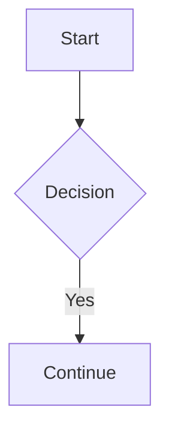

## Quick Answer

Upgrading to Astro 7 can leave `astro-mermaid` diagrams rendering as plain, unstyled code blocks instead of real diagrams, with this warning printed: `markdown.remarkPlugins/rehypePlugins/remarkRehype are set, but your satteri processor doesn't run them.` Update to `astro-mermaid@^2.1.0` or later. It adds native Sätteri support and the diagrams render again.

## Why the diagrams stop rendering

`astro-mermaid` only registered its diagram transform through the classic remark/rehype pipeline, checked with a helper that confirms the active processor is `unified()`. Astro 7's default Markdown processor is Sätteri, a separate Rust-based pipeline that never runs remark or rehype plugins at all. The moment that check fails, `astro-mermaid`'s transform never registers, so every ` ```mermaid ` fence passes through untouched.

There's no error to signal this. The fenced code block is still valid Markdown on its own, so it renders exactly like any other code block, syntax-highlighted but not converted into a diagram. [Issue #71](https://github.com/joesaby/astro-mermaid/issues/71), opened 2026-06-24 against `astro-mermaid@^2.0.4`, documents the exact warning Astro itself prints in this situation.

<Callout type="warning" title="No crash, just a silent downgrade">
  This is the kind of regression that survives a build and even a quick visual
  check, since a plain code block still looks intentional at a glance. The tell
  is checking whether the block actually rendered as a diagram, not whether the
  build succeeded.
</Callout>

## The fix: upgrade to astro-mermaid 2.1.0+

[PR #72](https://github.com/joesaby/astro-mermaid/pull/72), merged the same day as the issue, 2026-06-24, adds real Sätteri support. It detects the active processor and dispatches to one of three paths: a native Sätteri mdast plugin on Astro 7, the existing remark/rehype plugins unchanged on Astro 6.4's unified pipeline, or the original plugin arrays on anything older. The fix shipped in `astro-mermaid@2.1.0`.

```bash title="fix: update astro-mermaid"
npm install astro-mermaid@latest
```

The fenced code block syntax in your Markdown doesn't change at all:

````md title="src/content/blog/example/index.mdx"

````

<Callout type="info" title="Why the fix targets rawHtml specifically">
  The PR's own notes call out a subtlety worth knowing: it returns a plain HTML
  node rather than using Sätteri's MDX-style brace escaping, because that
  escaping would corrupt decision-node syntax like `B{Decision}` in the diagram
  source itself. A naive port of the old plugin wouldn't have caught this.
</Callout>

## Confirmed version range

This site doesn't use `astro-mermaid`, so this bug was never dogfooded here directly. It's a clean example of the broader pattern covered elsewhere in this series: any remark or rehype plugin written only against the old unified pipeline needs its own Sätteri-aware update, not just a version bump, since Sätteri has no compatibility layer for the old plugin API.

If you maintain a different remark or rehype plugin and see this same warning, check whether it's been updated for Astro 7 the same way `astro-mermaid` was, rather than assuming a plain upgrade will fix it.

Browse more fixes from this same upgrade in the [Guides & Fixes](/guides-fixes) archive.
